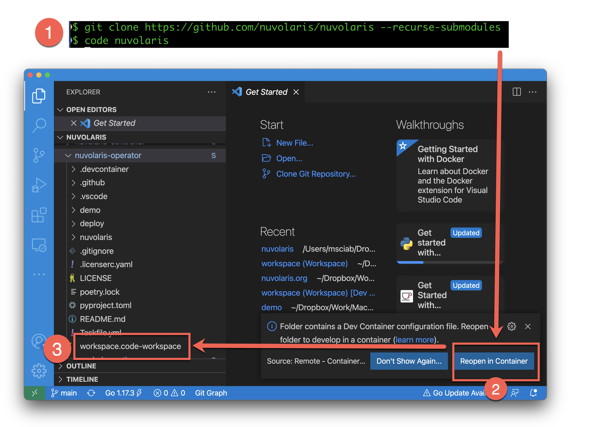

<!--
  ~ Licensed to the Apache Software Foundation (ASF) under one
  ~ or more contributor license agreements.  See the NOTICE file
  ~ distributed with this work for additional information
  ~ regarding copyright ownership.  The ASF licenses this file
  ~ to you under the Apache License, Version 2.0 (the
  ~ "License"); you may not use this file except in compliance
  ~ with the License.  You may obtain a copy of the License at
  ~
  ~   http://www.apache.org/licenses/LICENSE-2.0
  ~
  ~ Unless required by applicable law or agreed to in writing,
  ~ software distributed under the License is distributed on an
  ~ "AS IS" BASIS, WITHOUT WARRANTIES OR CONDITIONS OF ANY
  ~ KIND, either express or implied.  See the License for the
  ~ specific language governing permissions and limitations
  ~ under the License.
  ~
-->
# Nuvolaris

Welcome to the Nuvolaris project. 

Nuvolaris is an [ongoing project](#about) to build an Open Source distribution of [Apache OpenWhisk](https://openwhisk.apache.org) released under the [Apache Licence 2.0](LICENSE) (like OpenWhisk itself).

We want to build a *complete* distribution of a serverless environment that:

- it is easy to install and manage
- potentially runs in every Kubernetes, but it is tested against a set of supported distributions
- includes a (possibly large) number of integrated services

This is the main differentiation from Apache OpenWhisk, as it only provides a basic engine for serverless. Our goals are described in our [**roadmap**](docs/ROADMAP.md) document to read about.


## TL;DR

If you are in a hurry, here a few starting points:

- Download the [latest release](https://github.com/nuvolaris/nuvolaris/releases) of the CLI to install Nuvolaris, 
- Check our [YouTube Channel](https://www.youtube.com/channel/UCPt5hk7qcOkESjB7kii1byw) for our trainings and community calls.
- Chat with us on [Discord](https://discord.gg/VSGG7aQ2Ds) 

## Do you want to help?

If you are a developer, here a few more resources to read:

- If you want to test the cutting edge,  download a [pre-release](https://github.com/nuvolaris/nuvolaris-cli/releases) of the CLI and report issues
- Check our issue tracker for [unassigned and open issues](https://github.com/nuvolaris/nuvolaris/issues).
- Read the [Overview](docs/OVERVIEW.md) and the [Roadmap](docs/ROADMAP.md) 
- Check the [Developer Guide](docs/DEVEL.md) and the [Build Guide](docs/BUILD.md).

## Quick Start with our Development Environment

Prerequisites:

 - A machine with **AT LEAST 16 GIGABYTES OF MEMORY** 
 - Git, at least 2.x 
 - Docker, at least 20.x (either Docker Desktop or Docker CE) 
 - VSCode, at least 1.63.x
 
then  **`ASSIGN AT LEAST 8 GIGABYTES TO DOCKER`** and open the project as follows.



```
git clone https://github.com/nuvolaris/nuvolaris --recurse-submodules
code nuvolaris
```

VSCode should detect you are using a development container (because of the directory `.devcontainer`) and ask if you want to use it. Click on the button `Reopen in container`.

**NOTE** if the popup does not show up, it is possible you have disabled it. In such a case, click on `F1`, search for the command `Reopen in Container` and execute it.


The first time, since it needs to download a large image, it can take some time. It will download the Nuvolaris DevKit  and setup a local development Kubernetes cluster  using [kind](https://kind.sigs.k8s.io/).

Once you see the navigation tree, you will also see a few folders named `nuvolaris-*`. Those subprojects are the actual projects (the top-level project is only an holder). 

You can access to the various suprojects settings opening the files `workspace.code-workspace` in the `nuvolaris-*` subfolders.

**NOTE* If they `nuvolaris-*` folders are empty, this means you did not use `--recurse-submodules` when cloning the folders. You can fix this opening a terminal and typing:

```
git submodule init
git submodule update
```

This is the procedure to install everything and play with the source code. Usually however you want to work with each subproject individually. 

Check  [our development guide](docs/DEVEL.md) for more informations.

## How to contribute

- Either find an open and unassigned issue, or open one by yourself in the [Issue Tracker](https://github.com/nuvolaris/nuvolaris/issues) describing what you want to do.
- Please discuss with us and ensure you want to do is approved by the [project owners](docs/OWNERS.md), if you want to be sure your PR will be merged We can still merge unsolicited PR, but if you do not discuss it before there is some risk that for some reason we may unable to merge it. 
- Get an issue assigned. **Seriously**. 
- Code it!
## How to submit a contribution

If you want to contribute, **YOU HAVE TO PUT YOUR CODE UNDER A LICENSE** . 

Quick way to to it:

1. Fork the repository where you want to contribute (one of `nuvolaris/nuvolaris-*`) 

2. Push your changes to your fork

```
git remote add <user> https://github.com/<your-user>/<your-fork>
git push <user> main
```

3. Ensure all your contributions have a **LICENSE HEADER**.  We use the Apache License 2.0.

Use `license-eye` to check: `license-eye header check`.

If something is not properly licensed, you can fix automatically with:

```
license-eye header fix
```

Note that some kind of files are not recognized so you have to fix them adding a license header manually.

4. Commit, push and send a pull request to us and ask the project owners to review and merge it. 

## What is the next activity?

We split activities in [milestones](https://github.com/nuvolaris/nuvolaris/milestones?direction=asc&sort=title&state=open).

We name milestones after characters of the movies of The Matrix franchise. 

We reached the first milestone, [Neo](docs/Neo.md).

The current milestone is [Trinity](doc/Trinity.md).

The next milestones will be Morpheus, yet to be planned.

The milestone to reach when we release 1.0 is [Matrix](docs/Matrix.md).
 
